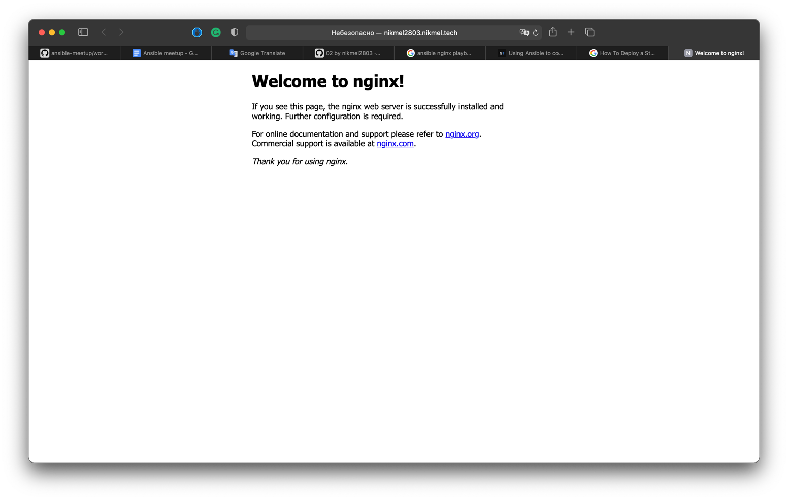

# Running commands

Создадим новый плейбук для установки nginx

```shell
touch nginx.yml
```

Сделаем таску, которая поставит nginx

```yaml
- hosts: all

  tasks:
    - name: Install nginx and update apt cache
      apt:
        name: nginx
        update_cache: yes
        state: latest
```

Теперь перейдём по домену, который выдал бот. Мы увидим приветственную страницу nginx


С помощью модуля service убедимся, что модуль nginx запущен и активирован:

```yaml
- hosts: all

  tasks:
    - name: Install nginx and update apt cache
      apt:
        name: nginx
        update_cache: yes
        state: latest

    - name: Enable nginx service
      service:
        name: nginx
        state: started
        enabled: yes
```

Теперь давайте попробуем заменить дефолтную страницу nginx на свою.

Для этого сделаем файл index.html и напишем в нём простую html страничку:

```html
<!DOCTYPE html>
<html lang="en">
<head>
    <meta charset="UTF-8">
    <title>CodeX Meetup</title>
</head>
<body>
    <h1>Hello yopta</h1>
</body>
</html>
```

Сделаем ещё одну таску, которая убедится, что в /var/www/html содержится нужный нам файл

```yaml
- hosts: all

  tasks:
    - name: Install nginx and update apt cache
      apt:
        name: nginx
        update_cache: yes
        state: latest

    - name: Copy index.html
      copy:
        src: index.html
        dest: /var/www/html

    - name: Enable nginx service
      service:
        name: nginx
        state: started
        enabled: yes
```

Запустим плейбук. Потом зайдём на сайт — увидим что страничка обновилась.

Теперь попробуем загрузить картинку.

Скачаем любую из интернета, поместим в рабочую папку. Напишем таску для копирования картинки:

```yaml
- hosts: all

  tasks:
    - name: Install nginx and update apt cache
      apt:
        name: nginx
        update_cache: yes
        state: latest

    - name: Copy index.html
      copy:
        src: index.html
        dest: /var/www/html

    - name: Copy index.html
      copy:
        src: codex.png
        dest: /var/www/html

    - name: Enable nginx service
      service:
        name: nginx
        state: started
        enabled: yes
```

И добавим картинку на нашу html страничку:

```html
<!DOCTYPE html>
<html lang="en">
<head>
    <meta charset="UTF-8">
    <title>CodeX Meetup</title>
</head>
<body>
<h1>Hello yopta</h1>

<p>
    
</p>
</body>
</html>
```

Запустим плейбук. Видим нашу картинку.

Теперь поменяем структуру файлов сайта в нашем каталоге. Сделаем папку site, внутри index.html и папка images с загруженной картинкой

Используем модуль synchronize, чтобы синхронизировать контент нашей локальной папки с папкой на сервере

```yaml
- hosts: all

  tasks:
    - name: Install nginx and update apt cache
      apt:
        name: nginx
        update_cache: yes
        state: latest

    - name: Sync site content
      synchronize:
        src: site/
        dest: /var/www/html
        delete: yes
        recursive: yes

    - name: Enable nginx service
      service:
        name: nginx
        state: started
        enabled: yes
```
