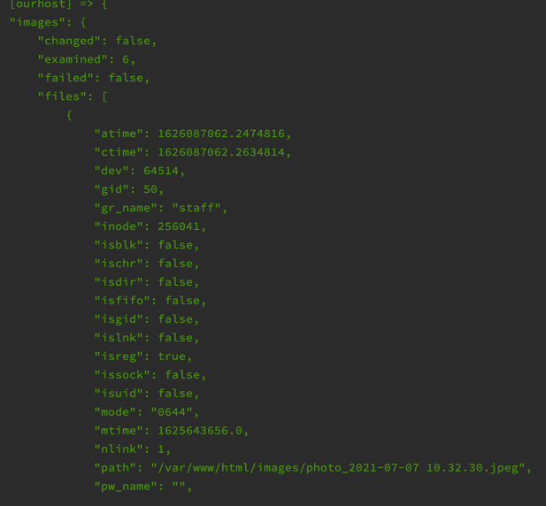

# Running commands

\* показываем слайды про переменные \*

\* потом практика \*

За основу возьмём плейбук из прошлой главы:

```yaml
- hosts: all

  tasks:
    - name: Install nginx and update apt cache
      apt:
        name: nginx
        update_cache: yes
        state: latest

    - name: Sync site content
      synchronize:
        src: site/
        dest: /var/www/html
        delete: yes
        recursive: yes

    - name: Enable nginx service
      service:
        name: nginx
        state: started
        enabled: yes
```

Для начала давайте попробуем задать title сайта с помощью переменной, а заодно познакомимся с шаблонами.
Шаблоны позволяют нам генерировать файлы на основе заданных шаблонов. В качестве движка для шаблонов в Ansible используется Jinj2

Поменяем файл index.html так, чтобы в title подставлялось значение из переменной:

```html
<head>
    <meta charset="UTF-8">
    <title>{{ site_title }}</title>
</head>
```

Теперь в title будет подставляться значение переменной site_title

Запустим плейбук и посмотрим на результат:


Как мы видим, значение title было взято как есть, то есть наша переменная не подставилась.
Произошло это потому, что модуль synchronize не умеет работать с шаблонами.
Для того чтобы сгенерировать файл по шаблону, нужно воспользоваться модулем template. Давайте сделаем это. 

```yaml
- hosts: all

  tasks:
    - name: Install nginx and update apt cache
      apt:
        name: nginx
        update_cache: yes
        state: latest

    - name: Sync site content
      synchronize:
        src: site/
        dest: /var/www/html
        delete: yes
        recursive: yes

    - name: Render and copy index.html
      template:
        src: site/index.html
        dest: /var/www/html

    - name: Enable nginx service
      service:
        name: nginx
        state: started
        enabled: yes
```

Если мы запустим этот плейбук, то получим ошибку, так как наша переменная `site_title` нигде не определена.
Давайте определим её в play:

```yaml
- hosts: all
  vars:
    site_title: CodeX Meetup
```

Теперь все работает как и ожидается. Но есть одна проблема. Давайте попробуем запустить наш плейбук несколько раз.
Можно заметить, что запуск плейбука каждый раз меняет состояние на сервере.
Это не рекомендованное поведение, так мы теряем свойство идемпонентности у этого плейбука. 
Это происходит из-за того, что каждый раз модуль `synchronize` записывает файл index.html на сервер,
а потом мы этот же файл перезаписываем с помощью модуля template. То есть сначала мы записываем файл как он есть, а потом уже его отрендеренную версию.
Чтобы это исправить, давайте синхронизировать не всю папку site, а только images:

```yaml
- hosts: all
  vars:
    site_title: CodeX Meetup

  tasks:
    - name: Install nginx and update apt cache
      apt:
        name: nginx
        update_cache: yes
        state: latest

    - name: Sync site content
      synchronize:
        src: site/images/
        dest: /var/www/html/images
        delete: yes
        recursive: yes

    - name: Render and copy index.html
      template:
        src: site/index.html
        dest: /var/www/html

    - name: Enable nginx service
      service:
        name: nginx
        state: started
        enabled: yes
```

Попробуем снова несколько раз запустить плейбук.
Теперь, если состояние не меняется, Ansible не производит никаких изменений в конфигурации. 
Если мы поменяем site_title, то мы увидим изменение только в таске с модулем template.


Давайте теперь усложним задачу. Посмотрим как можно создавать переменные и как использовать циклы в шаблоне.
Скачаем несколько картинок из гугла и положим их в папку images.
Теперь давайте выведем все изображения из папки images на нашу страницу.

Для этого нам нужно в переменную положить информацию обо всех файлах, которые находятся в этой папке.
Воспользуемся модулем `find` для того чтобы собрать информацию о файлах в папке

```yaml
    - name: Get all images
      find:
        paths: /var/www/html/images
      register: images
```

Используем ключевое слово `register` чтобы создать новую переменную `images` и положить в неё результат выполнения этой таски.
Теперь давайте посмотрим что содержится в этой переменной. Для этого воспользуемся модулем `debug`:

```yaml
    - debug:
        var: images
```

Запустим плейбук и посмотрим результат.

Видим, что наша переменная `images` содержит поле `files`, где хранится массив с информацией о картинках.

Воспользуемся этой информацией, чтобы вывести все картинки в `index.html`. Отредактируем шаблон:

```html
<!DOCTYPE html>
<html lang="en">
<head>
    <meta charset="UTF-8">
    <title>{{ site_title }}</title>
</head>
<body>
    <h1>Hello yopta</h1>


    <p>
        <h2>{{ image.path | basename }}</h2>
        
    </p>

</body>
</html>
```

\* Далее идёт объяснение про цикл и фильтры \*
